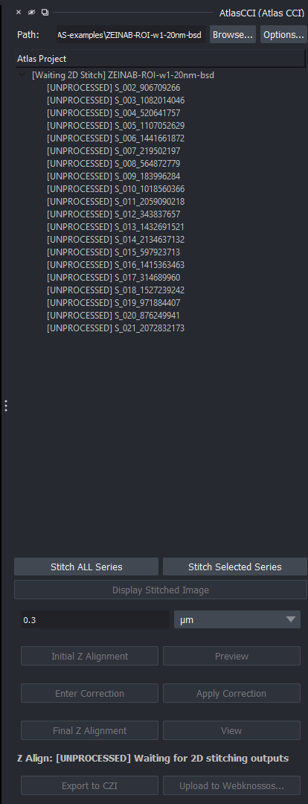
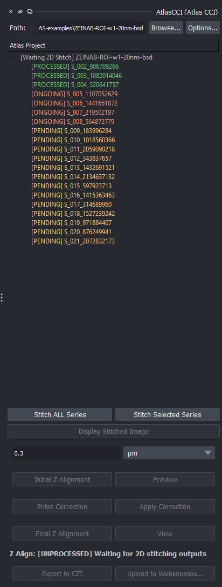
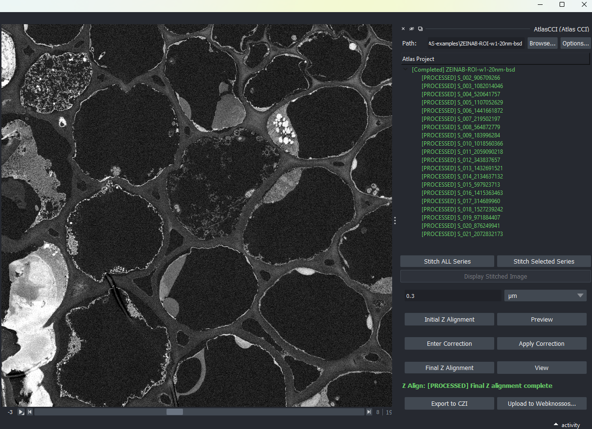
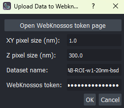

# napari atlas cci

Napari plugin to give a GUI interface to the cci atlas tool.

This is a wrapper around the [cci atlas](https://github.com/CCI-GU-Sweden/ATLAS) package.

## Installation

A standalone version of napari is available at [napari.org](https://napari.org/dev/tutorials/fundamentals/installation_bundle_conda.html), and the plugin is available on the [napari hub](https://napari-hub.org/plugins/napari-omero-downloader-cci.html). Just follow the installation instruction from napari. You can install the plugin from the plugin manager.

It is also possible to install the plugin from [source code](https://github.com/CCI-GU-Sweden/napari-atlas-cci) or from pip with `pip install napari-atlas-cci`. In this case, be sure to isolate the installation in a dedicated environment with napari.

## How to use

Browse and load an atlas project. An atlas project is composed of a series of S_ folder, each containing 1 or multiple tiff images.

### 2D stitching

For 2D stitching, it is possible to process one, multiple or all S_ folder. This will stitch images in a S_ folder in one tiff image. The number of images being processes at the same time is dependent to the number of core in your PC. Be carefull on RAM consumption.

After processing, you can select one S_ folder and display the image in Napari.

### Z alignement

It is only possible to process to the z-alignement if all S_ folder has been stitched.
The alignement is required to run first a on downsampled image. This downsampling factor can be control in the Options.

Once the initial alignement is completed, a preview image is display. Please confirm that the alignement is correct through the z volume.

It is possible to add correction in the alignement by clicking the "Enter Correction" button. It will create a couple of point layers, called "Fixed points" and "Moving points".

Move to a plane **before** the shift, and identify one striking feature with the Fixed points layer. Then move one Z-slice up, select the "Moving points" layer and identify the same feature. You can repeat as many time as necessary, however all points need to be paired.

Once done, click on the "Apply correction" button. It will reprocess the downsample image, then display the corrected zstack. Check that the correction happen.

WIP: Small video Youtube to display alignement correction.

Once the data is aligned, it can be processed for the "Final Z Alignement". This step can be time consuming based on the size of the dataset, so please, be patient.

### Export and upload

All intermediate files are stored in the root folder of the Atlas project. Individual planes are stored as tiff images, will the alignement is stored as a pickle pandas table. The z aligned files (both the downsample and the final ones) are saved in a ome-zarr format.

For easier data manipulation, it is possible to export the final alignement as a czi file. The other option is to upload the data on [Webknossos](https://webknossos.org/), which is great for both visualization and fine z-alignement. To do this upload, it is required to have a account on webknossos and to indicate your token for the upload.

## Troubleshooting

WIP

## Contributing

Contributions are very welcome. Tests can be run with [tox], please ensure
the coverage at least stays the same before you submit a pull request.
